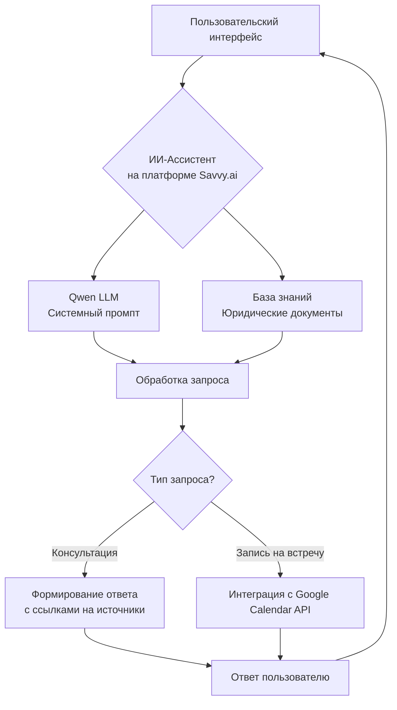

# 📋 Проект: ИИ-Юрист-ассистент

*Интеллектуальный помощник для юридических консультаций и автоматизации рутинных задач*


## 📌 Краткое описание

**ИИ-Юрист-ассистент** — это интеллектуальная платформа на основе больших языковых моделей, предназначенная для предоставления юридических консультаций, ответов на правовые вопросы и автоматизации первичного взаимодействия с клиентами. Система сочетает глубокую юридическую экспертизу с удобным диалоговым интерфейсом и интеграцией бизнес-инструментов.
ССылка на телеграм=чат- @Operpravocentr_bot

---

## 🎯 Цели проекта

- **Доступность юридической помощи**: Предоставление базовых юридических консультаций 24/7 без ожидания
- **Снижение нагрузки на юристов**: Автоматизация ответов на типовые вопросы и первичная фильтрация запросов
- **Повышение конверсии**: Упрощение записи на консультацию и минимизация барьеров для клиентов
- **Масштабируемость**: Возможность одновременного обслуживания множества пользователей

---

## ⚙️ Функциональные возможности

### 1. Осмысленное ведение диалога с помощью нейросетей

- Контекстное понимание: сохранение контекста беседы в течение сессии для естественного диалога
- Многоступенчатые запросы: анализ сложных ситуаций через уточняющие вопросы
- Тональная адаптация: корректировка стиля общения (формальный/дружелюбный) под предпочтения пользователя
- Мультиязычная поддержка: работа с запросами на русском, английском и других языках

### 2. Ответы на вопросы по базе знаний

- Верифицированная информация: ответы строго на основе загруженной юридической базы знаний (законодательство, прецеденты, шаблоны документов)
- Источники в ответах: автоматическая ссылка на нормативные акты и статьи базы знаний
- Ограничение спекуляций: чёткое разделение между фактами из базы знаний и рекомендациями «обратиться к юристу» для сложных случаев
- Регулярное обновление: механизм актуализации базы знаний при изменении законодательства

### 3. Запись на встречу и интеграция с календарём

- Интерактивный выбор времени: предложение доступных слотов на основе расписания юриста
- Автоматическая синхронизация: мгновенное добавление события в Google Календарь юриста и отправка приглашения клиенту
- Напоминания: автоматические уведомления за 24 часа и за 1 час до консультации
- Отмена/перенос: возможность изменения записи через диалог с ассистентом

---

## 🏗️ Архитектура решения



---

## 🔌 Интеграция с сервисами

### 🧠 Qwen (Alibaba Cloud)

**Назначение компонентов:**

- **Системный промпт**: создание детального системного промпта с ролью «опытного юриста», правилами этики, ограничениями и структурой ответов
- **База знаний**: форматирование юридических документов (ГК РФ, ТК РФ, КоАП и др.) в оптимальный для RAG-поиска формат
- **Модель**: использование Qwen3-72B или Qwen3-235B для максимальной точности юридических формулировок

**Пример структуры системного промпта:**

```text
Ты — профессиональный юрист с 15-летним стажем. Твоя задача — предоставлять точные юридические консультации на основе загруженной базы знаний.

Правила:
1. ВСЕГДА указывай источник информации (статья закона, пункт договора)
2. При отсутствии информации в базе знаний — чётко сообщи: «Данная информация отсутствует в моей базе. Рекомендую проконсультироваться с юристом»
3. НИКОГДА не давай гарантий по исходу судебных дел
4. Для сложных ситуаций (развод с детьми, корпоративные споры) — рекомендуй личную консультацию
5. Сохраняй нейтральный, профессиональный тон
```

### 🤖 Savvy.ai — платформа для создания ИИ-ассистента

**Реализация функций:**

- **Хостинг ассистента**: размещение кастомизированной версии ИИ-агента с персонализированным поведением
- **Диалоговый интерфейс**: готовые виджеты для встраивания на сайт/в мессенджеры
- **Интеграции**: встроенные коннекторы для Google Calendar, Slack, Telegram
- **Аналитика**: отслеживание популярных запросов, точности ответов, конверсии в записи

**Примечание**: при необходимости платформа Savvy.ai может быть заменена на аналогичные решения (LangChain + FastAPI, Voiceflow, Dify.ai) с сохранением архитектуры.

---

## 📅 План реализации

**Этап 1: Подготовка базы знаний**
- Срок: 1 неделя
- Результат: структурированный набор юридических документов в формате для RAG

**Этап 2: Настройка Qwen**
- Срок: 3 дня
- Результат: системный промпт + тестирование точности ответов

**Этап 3: Создание ассистента на Savvy.ai**
- Срок: 2 дня
- Результат: настроенная учётная запись, подключённая к Qwen API

**Этап 4: Интеграция с Google Calendar**
- Срок: 2 дня
- Результат: OAuth2-авторизация, тестирование создания/отмены событий

**Этап 5: Тестирование**
- Срок: 1 неделя
- Результат: пилот с 20 реальными запросами, коррекция ошибок

**Этап 6: Запуск**
- Срок: 2 дня
- Результат: встраивание виджета на сайт, обучение сотрудников

---

## 🛡️ Ограничения и этические гарантии

- Дисклеймер в каждом ответе: «Я — ИИ-ассистент. Для сложных случаев обратитесь к юристу»
- Логирование запросов: хранение истории для аудита и улучшения качества
- Защита персональных данных: шифрование данных клиентов, соответствие ФЗ-152 (РФ) / GDPR (ЕС)
- Человеческий контроль: все запросы на «срочную помощь» автоматически передаются живому юристу

---

## 📊 Ожидаемые метрики эффективности

**Ответы без участия юриста**
- Базовый уровень: 0%
- Цель через 3 месяца: 65% типовых запросов

**Среднее время ответа**
- Базовый уровень: 4 часа
- Цель через 3 месяца: менее 15 секунд

**Конверсия в запись**
- Базовый уровень: 12%
- Цель через 3 месяца: 28%

**Удовлетворённость клиентов (CSAT)**
- Базовый уровень: не измеряется
- Цель через 3 месяца: не менее 4.5 из 5.0

---

## 💡 Преимущества решения

**Для клиентов:**
- Мгновенные ответы в нерабочее время
- Прозрачность источников информации

**Для юристов:**
- Фильтрация простых запросов
- Автоматизация записи на консультации
- Возможность сфокусироваться на сложных кейсах

**Для бизнеса:**
- Снижение стоимости лида на 40%
- Масштабирование без найма дополнительных специалистов

---

## 🚀 Дальнейшее развитие

- Интеграция с электронным документооборотом (подготовка исковых заявлений)
- Анализ договоров на риски через computer vision
- Мультиканальная поддержка (WhatsApp, Telegram, Viber)
- Персонализация под отраслевую специфику (IT, строительство, медицина)

---

> **Дата подготовки**: 9 февраля 2026 г.
> **Статус**: Готов к техническому проектированию и запуску пилота
